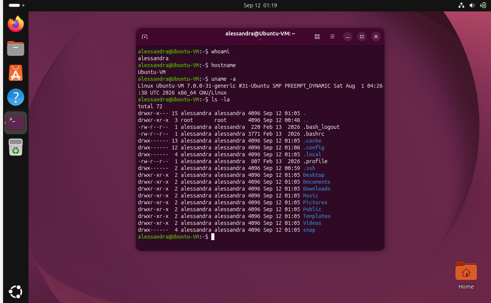

# Local Virtual Machine Setup

## Overview

A local Ubuntu virtual machine was created on a Windows computer using Oracle VirtualBox. The purpose of the setup was to verify that Ubuntu could be installed, started, and accessed successfully through its terminal.

## System and Software

The host operating system is Windows, and Oracle VirtualBox was used as the hypervisor. The guest operating system was installed from an Ubuntu 26.04.1 LTS Desktop ISO.

The virtual machine was configured with:

- **VM name:** Ubuntu-VM
- **Memory:** 4096 MB
- **Processors:** 2
- **Virtual disk:** 25 GB
- **Guest operating system:** Ubuntu 26.04.1 LTS

Git Bash is also available on the Windows host and can be verified with:

```bash
git --version
```

## Virtual Machine Creation

Oracle VirtualBox was opened and a new virtual machine named `Ubuntu-VM` was created. The Ubuntu ISO file was selected as the installation image.

The VM was assigned 4096 MB of RAM, 2 processors, and a 25 GB virtual hard disk. EFI was left disabled for this setup.

After the configuration was completed, the virtual machine was started and the Ubuntu installer was launched.

## Ubuntu Installation

The Ubuntu ISO initially opened a live environment. In that session, the terminal prompt appeared as:

```text
ubuntu@ubuntu:~$
```

This indicated that Ubuntu was running from the installation media rather than from the installed virtual disk.

The **Install Ubuntu 26.04.1 LTS** option was then used to install Ubuntu onto the 25 GB VirtualBox virtual disk. After the installation completed, the VM was restarted so that Ubuntu could boot from the installed virtual disk.

## Verification

After logging into Ubuntu, the terminal was used to confirm that the virtual machine was operating correctly.

The following commands were used:

```bash
whoami
```

```bash
hostname
```

```bash
uname -a
```

These commands display the active username, the system hostname, and Linux kernel/system information.

## Proof of Login

The screenshot below shows the Ubuntu terminal running successfully inside the virtual machine.



## Notes

One issue encountered during the setup was the difference between the Ubuntu live environment and the fully installed system. The live session used the default `ubuntu@ubuntu` prompt, so the final login screenshot should be taken only after Ubuntu has been installed and the VM has restarted from its virtual hard disk.

The VM configuration of 4096 MB of RAM, 2 processors, and a 25 GB virtual disk was sufficient for the assignment while leaving enough resources available for the Windows host.
