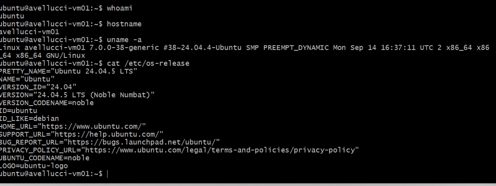
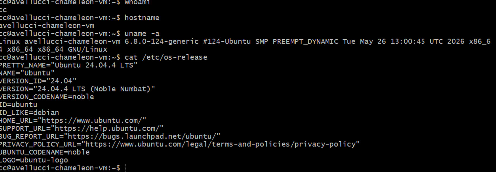
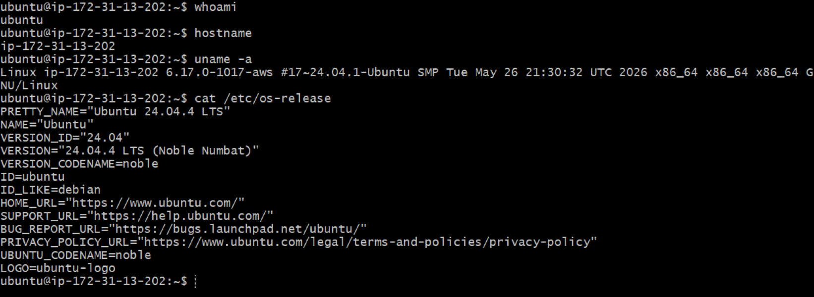

# Week 3: Virtual Machines

## Jetstream VM

A virtual machine was created on Jetstream2 using the OpenStack Horizon interface. The instance was configured with an Ubuntu 24.04 image, an SSH public key, and a floating IP address so that the machine could be accessed remotely from Git Bash.

The instance was named `avellucci-vm01`. Terminal access was verified successfully through SSH. The commands `whoami`, `hostname`, `uname -a`, and `cat /etc/os-release` confirmed the active user, hostname, Linux kernel, and Ubuntu version.

## Chameleon Cloud VM

A virtual machine was created on Chameleon Cloud using the KVM@TACC environment. Before the VM was launched, a one-hour lease was created for an `m1.small` flavor with 1 vCPU, 2 GB of RAM, and a 20 GB disk.

The instance was named `avellucci-chameleon-vm` and used the `CC-Ubuntu24.04` image. An SSH public key and an SSH security group were configured, and a floating IP address was associated with the instance for remote access.

Terminal access was verified using the `cc` account. The commands `whoami`, `hostname`, `uname -a`, and `cat /etc/os-release` confirmed that the VM was running Ubuntu 24.04 successfully.

## AWS Public Cloud VM

As an optional public-cloud exercise, an Amazon EC2 virtual machine was created using Ubuntu Server 24.04 LTS. A `t3.micro` instance type was selected because it was marked as Free Tier eligible.

The VM used the existing `avellucci_ssh` public key for authentication. A security group was configured to permit SSH access, and a public IPv4 address was assigned automatically.

Terminal access was verified successfully from Git Bash. The commands `whoami`, `hostname`, `uname -a`, and `cat /etc/os-release` confirmed that the EC2 instance was running Ubuntu 24.04.

## Comparing VM Creation

The local VirtualBox VM provided the greatest amount of direct control over the virtual hardware and operating-system installation. Memory, processor count, virtual disk size, and the Ubuntu ISO were configured directly on the Windows host. This approach was straightforward and did not depend on an external cloud service, but the VM consumed local computer resources while it was running.

Jetstream2 simplified the operating-system setup because the Ubuntu image was already prepared. Instead of installing Ubuntu manually from an ISO, the main tasks involved selecting an image and flavor, configuring an SSH key, attaching a network, and assigning a floating IP address. The instance could then be accessed remotely without using local CPU and memory resources.

Chameleon Cloud required more planning than Jetstream2 because compute resources had to be reserved before the VM could be launched. A one-hour lease was created first, followed by the selection of the reserved flavor, Ubuntu image, SSH key, network configuration, security group, and floating IP. This workflow introduced an additional reservation-management step, but it also demonstrated how shared research-cloud resources can be scheduled and controlled.

AWS EC2 provided a streamlined commercial-cloud workflow. Ubuntu 24.04, a Free Tier eligible instance type, an SSH key, a security group, and a public IP were configured directly from the launch page. Compared with Chameleon, AWS did not require a separate time-based resource reservation. However, additional attention was required to avoid unnecessary charges and to terminate the instance after the experiment was completed.

Overall, all four environments successfully provided Ubuntu-based virtual machines, but the setup process differed significantly. VirtualBox required the most direct operating-system installation work, Jetstream2 emphasized OpenStack networking and SSH access, Chameleon added explicit resource reservation, and AWS provided the most integrated public-cloud launch workflow.
